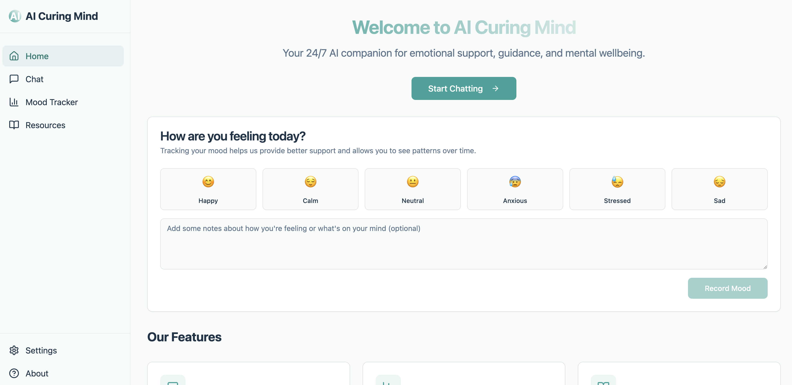
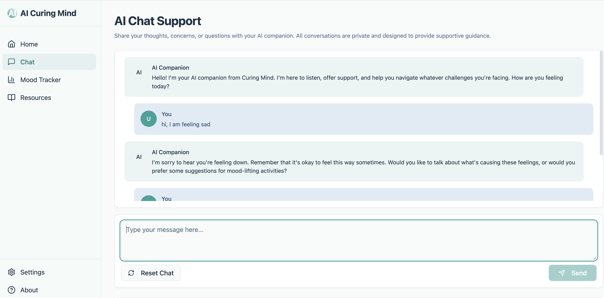
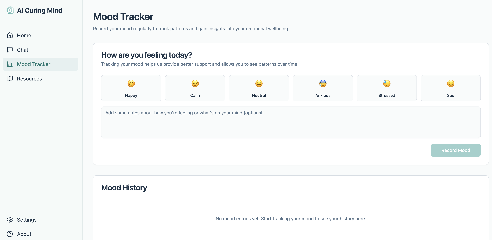
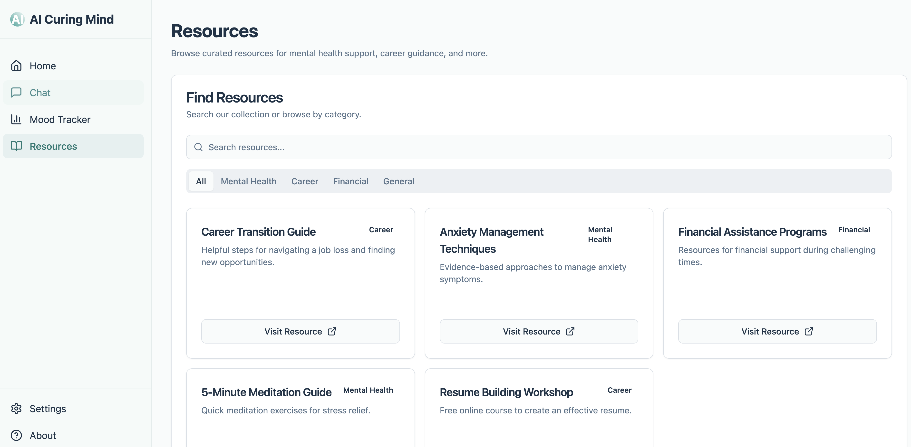

# 🚀 AI Curing Mind App

Empowering individuals with affordable, accessible emotional support through AI-driven conversations.

Note: most of the code is generated by AI tool: https://app.omniflow.team/ Really thanks the product to help people boost productivity.

---

## 🧠 Problem & Opportunity

Many individuals facing emotional stress, mental health challenges, or financial hardship lack accessible and affordable support.  
- Laid-off employees often experience anxiety and uncertainty about the future.  
- Those with mental illnesses struggle to find daily coping strategies and professional resources.  
- Low-income individuals cannot afford therapy, leaving their mental health needs unmet.

**Future Opportunity:**  
This project leverages AI chat technologies (such as **ChatGPT** and **Deepseek**) to create a 24/7, low-cost, empathetic companion that boosts confidence, offers coping strategies, and connects users to external resources.

---

## 🎯 Target Audience & User Persona

**Primary Audiences:**
- **Alex (35)** — Recently laid off; seeking emotional support and career advice.
- **Sam (28)** — Managing anxiety and depression; needs daily coping exercises and reassurance.
- **Maria (45)** — Low-income; cannot afford therapy; looking for affordable mental health resources.

**Secondary Audiences:**  
- Children and elderly users who benefit from a simplified interface and clear, guided experiences.

---



---

## ✨ Overview


**What does this project do?**
- Cures people in need by providing emotional support and guidance.

**Why did you build it?**
- To make a meaningful impact by helping people navigate emotional challenges affordably.

**Key Features:**
- 🏠 Home  
- 💬 Chat (AI Companion)  
- 📈 Mood Tracker  
- 📚 Resources & Guidance  

---

## 📸 Screenshots
- Chat Page

- Mood Tracker Page

- Resources Page


---

## 📦 Tech Stack

- **Frontend:** React

---

## ⚙️ Setup & Installation

```bash
# 1. Clone the repository
git clone https://github.com/FrozenfireMinghang/ai-curing-mind.git

# 2. Go into the project folder
cd ai-curing-mind

# 3. Install dependencies
npm install

# 4. Start the development server
npm run preview

the preview window may be http://localhost:4173/
